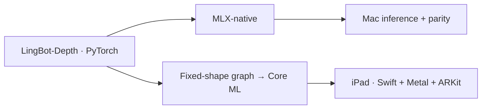

<div align="center">

# LingBot-Depth · Apple Silicon

### MLX-native on Mac. Core ML on iPad.

**RGB + Depth → Metric Depth → RGB Point Cloud**


[Porting](#porting) · [Validation](#validation) · [iPad beta](#ipad-beta) · [Quick start](#quick-start)

</div>

> **RGB-D, not RGB-only.** Refines aligned RGB + sensor depth into metric depth in meters. Uses the original LingBot-Depth weights; no retraining.

## Porting

Two independent paths from the same PyTorch checkpoint—not MLX → Core ML.



| | Mac · MLX | iPad · Core ML |
|---|---|---|
| Model | Native Transformer, decoder, depth/mask heads | Fixed-shape ML Program |
| Porting | OIHW/IOHW → OHWI weights; matched preprocessing and interpolation | Static tokens + attention mask; invalid-depth sanitization |
| Precision | FP32 reference; BF16 and quantization experiments | **56 convolutions in FP16; rest FP32** |
| Runtime | MLX attention and array operations | **CPU+GPU**, Metal preprocessing |
| Baseline | Original checkpoint parity | **safe107 · Eco1200 · 560 × 420** |

[Swift runtime](ios/Packages/LingBotDepthRuntime) · [Model manifest](models/model-manifest.json) · **Model download: TBD**

## Validation

Results as of **September 6, 2026**. Numerical agreement, GT accuracy, and device functionality are separate checks.

### safe107 · Core ML vs. MLX FP32

**Same-input output agreement—not ground-truth accuracy.**

| Metric | Mac · 60 iBims cases | iPad · 1 fixed frame |
|---|---:|---:|
| Depth MAE | **0.599 mm** | **0.434 mm** |
| Depth RMSE | **0.794 mm** | **0.624 mm** |
| AbsRel | **0.01892%** | **0.01810%** |
| Maximum pixel error | 68.87 mm | 49.80 mm |
| Mask IoU | ≥0.999834 | 1.0 |
| Evaluated pixel coverage | 100% | 100% |

Mac MAE/RMSE/AbsRel are sample means; maximum error and minimum IoU cover all 60 cases. iPad agreement uses the last saved output of one fixed frame, not a 60-case device evaluation.

[60-case metrics](evidence/full60-metrics.json) · [Device & GT summary](evidence/safe107-evidence.json)

### Depth quality

**iBims-1:** 20 indoor images × 3 synthetic depth corruptions—central holes, 500 sparse samples, and 1/8-resolution depth. Predictions are evaluated against laser-scanner GT, not real iPad LiDAR GT.

| safe107 · 60-case mean | Result |
|---|---:|
| MAE | **3.997 cm** |
| RMSE | **0.118032 m** |
| AbsRel | **1.1865%** |

Three selected [public fixtures](fixtures/public) cover the worst cases:

| Criterion | Sample | Error |
|---|---|---:|
| GT AbsRel | `lab_11-sparse-500` | 3.0783% |
| GT maximum pixel error | `corridor_01-sparse-500` | 18.48 m |
| MLX agreement: maximum pixel error | `corridor_01-lowres-8x` | 68.87 mm |

The **18.48 m GT outlier also occurs in PyTorch**: at the same pixel, GT is 34.618 m, PyTorch 16.149 m, and Core ML 16.143 m. Nearby GT is about 15–17 m; a GT anomaly is possible but unconfirmed.

Fresh Mac Core ML inference on all three fixtures **exactly reproduced the saved depth/mask outputs**. The [reproduction report](evidence/standalone-reproduction.json) also provides pixel p99, mask coverage, and viewer-excluded depth fractions.

### On-device status

| Historical M2 iPad Pro beta | Result |
|---|---|
| Camera + LiDAR | Preview, capture, inference, both RGB 3D views verified |
| Model inference | **1.12–1.30 s** in two UI-reported captures |
| Total capture processing | **1.32–1.51 s** in those captures |

These are individual captures, not a controlled speed benchmark. **safe107 remains the default; ANE acceleration is unproven.** The current app revision passes an unsigned iOS Release build; its physical-device retest is pending.

## iPad beta

**Preview → Capture once → Explore RGB 3D → Toggle LingBot / LiDAR**

- Side-by-side RGB + LiDAR preview targeting **30 Hz—not 30 inferences/sec**.
- One button freezes RGB, depth, and camera metadata; runs one inference.
- RGB-colored point clouds with orbit/zoom and viewpoint-preserving source switching.
- Shared input grid and camera intrinsics; 2-pixel sampling, displayed depths in **(0.01, 10] m**.

The viewer's range filter can hide out-of-range predictions; validation reports their excluded fraction.

[App source](ios/Apps/LingBotDepthBench/Sources/BetaCaptureView.swift) · [Xcode project](ios/Apps/LingBotDepthBench/LingBotDepthBench.xcodeproj)

## Quick start

### Mac · Core ML validation

Apple Silicon Mac, Python 3.10–3.13, and `uv`. Run from the repository root.

```bash
uv sync --extra test
uv run python validate.py verify

# Recompute GT/agreement metrics from saved outputs; no model needed.
uv run python validate.py run --saved --output outputs/saved.json
```

**Model download: TBD.** Place the complete safe107 Core ML package at `models/model.mlpackage`, then run fresh inference:

```bash
uv run python validate.py verify --model models/model.mlpackage
uv run python validate.py run --model models/model.mlpackage \
  --output outputs/fresh.json
```

Both the CLI and app verify every package file against the [pinned manifest](models/model-manifest.json). Its SHA-256 identifies the source package, not a compiled `.mlmodelc`:

```text
ee3ceba8609ff768e55217979b6226c9034a627133c769f6ede7d058361fdccf
```

Use an unused output path. A completed run means metrics were computed; `all_saved_outputs_numerically_equal` separately reports exact reproduction.

### iPad · Build & install

Requires Xcode, a LiDAR-equipped iPad on iPadOS 18+, Developer Mode, an unlocked/trusted device, and signing credentials.

```bash
export DEVELOPER_DIR=/Applications/Xcode.app/Contents/Developer
xcrun xctrace list devices

export LINGBOT_IPAD_UDID="YOUR_HARDWARE_UDID"
export LINGBOT_SIGNING_TEAM="YOUR_TEAM_ID"

uv run python validate.py install --model models/model.mlpackage \
  --device "$LINGBOT_IPAD_UDID" --team "$LINGBOT_SIGNING_TEAM"
```

**Build → install → copy verified model → launch.** Grant camera access and wait for readiness. Add `--dry-run` to preview commands, or `--bundle-id com.yourname.LingBotDepthBench` for your signing team.

<details>
<summary>Tests</summary>

```bash
uv run pytest
DEVELOPER_DIR=/Applications/Xcode.app/Contents/Developer \
  xcrun swift test --package-path ios/Packages/LingBotDepthRuntime
```

**29 Python + 2 Swift tests passed:** metrics, hashes, installation commands, camera geometry, and app projection/preview logic.

</details>

## Remaining work

- **Quality:** Real LiDAR + independent GT and held-out scenes.
- **Performance:** Controlled device comparisons before changing the selected model.
- **Release:** Model download **TBD**, current-app device retest, broader device coverage.

---

## Credits & license

An independent Apple-platform port of **LingBot-Depth**, not an official distribution.

[Apache 2.0](LICENSE) · [Original model](https://huggingface.co/robbyant/lingbot-depth-pretrain-vitl-14-v0.5)

Data: [iBims-v1](https://mediatum.ub.tum.de/1455541), Tobias Koch, Lukas Liebel, Friedrich Fraundorfer, Marco Körner (2019), [CC BY 4.0](https://creativecommons.org/licenses/by/4.0/). See [attribution and modifications](fixtures/public/ATTRIBUTION.md).
